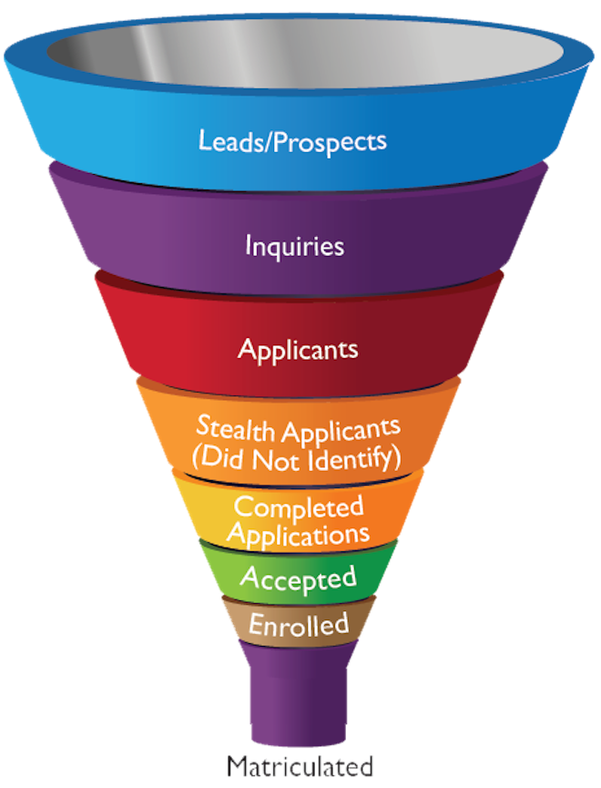

```{r setup, include=FALSE}
library(knitr)
```


# Introduction

I CUT ALL TEXT FROM THIS SECTION. THESE ARE TABLES/FIGURES FROM THE SECTION.



```{r, echo=FALSE}
# create a figure for percent budget allocated to marketing/recruiting activity
pct_budget <- data.frame(
  activity = c("Travel","Student search (purchased lists)","Prospective student communications","Events","Recruitment publications","Web services and digital advertising","Traditional advertising","International recruitment","Transfer recruitment","Other"),
  private = c(17,14,13,12,11,11,6,5,4,8),
  public = c(16,12,17,11,15,13,6,3,4,3)
)

kable(
  x = pct_budget, 
  col.names = c("Activity", "Private", "Public"),
  caption = "Percentage of budget allocated to marketing/recruiting activities by private non-profit 4yr and public 4yr institutions"
)
# 
```


# What Do We Know About Off-campus Recruiting?

Our research analyzes off-campus recruiting visits by college and university admissions staff. So what do we know about off-campus recruiting? As is true for most aspects of enrollment management, much of what we know about off-campus recruiting comes from consulting firms (e.g., Ruffalo-Noel Levitz, EAB), professional associations (e.g., NACAC), and from practioner-oriented publications. Market research conceives of off-campus recruiting visits as a means of identifying prospects, deepening engagement with prospects already being targeted through mail/email, and maintaining relationships with guidance counselors at “feeder schools” [@RN4323; @RN4402; @RN4664]. With respect to expenditure, @RN4664 found that private (non-profit) 4-yr institutions spent an average of 17% of their undergraduate marketing/recruiting budget on "travel" to high schools and college fairs (as shown in Table X), a higher percentage of budget allocation than any other marketing/recruiting activity. Public institutions spent an average of 16% of their budget on travel, second only to "prospective student communications" at 17%. An emergent trend over the past decade -- partially a response to public universities seeking nonresident students -- has been the growth of "regional recruiters" who target specific metropolitan areas in the US and abroad. These regional recruiters may be college/university employees or they may be independent contractors who live in the metropolitan area they recruit.

@RN4402 documents the self-reported efficacy of marketing/recruiting interventions. For the median private 4-yr institution, off-campus visits were the second highest source of inquiries (after student list purchases), accounting for 17% of inquiries. Off-campus visits were tied with student list purchases as the highest source of enrollees, accounting for 18% of enrollees. For the median public institution, off-campus visits accounted for 19% of inquiries (second only to student list purchases) and accounted for 16% of enrollees (ranked third after stealth applicants and on-campus visits).

A sociological case-study literature develops helpful insights about the mechanisms and functions of off-campus recruiting visits. @RN4324 analyzes visits from the perspective of students at two racially and socioeconomically diverse public high schools. @RN4324 found that high school visits -- including college fairs, instant decision events, and small-group representative visits -- influenced where students applied and where they enrolled. This finding was strongest for first-generation students and under-represented students of color, who often reported that "school counselors had low expectations for them and were too quick to suggest that they attend community college." This trust vacuum created an opportunity for colleges because these students were drawn to colleges that connected with them and "made them feel wanted."  @RN4324 describes a high-achieving, first-generation, African American student who was admitted by a highly selective liberal arts college but chose to attend a less selective college that "seemed to want him more." By contrast, affluent students with college educated parents were less taken by such overtures and more concerned with college prestige.  

Of particular importance for this chapter, @RN3519 and @RN4321;@RN4407 highlight the relational function of visits.  @RN3519 provides an ethnography of the admissions office at a selective private liberal arts college, highlights the relational function of visits. During the autumn "travel season," admissions officers visited selected high schools across the country "to spread word of the institution and maintain relationships with guidance counselors" (p. 53-54) because "the College's reputation and the quality of its applicant pool are dependent upon its connections with high schools nationwide" {@RN3519} [p. 54]. The College tended to visit the same schools year after year because recruiting depends on long-term relationships with high schools. The high schools they visited tend to be affluent schools -- in particular, private schools -- that enroll high-achieving students who can afford tuition and had the resources and motivation to host a successful visit. Whereas @RN4402 highlights the effect of recruiting visits on inquiries and enrollees, findings from @RN3519 suggest that the College may have valued recruiting visits primarily as a means of maintaining relationships with guidance counselors. From this perspective, recruiting visits may affect outcomes such as inquiries, applications, and matriculation through their affect on high school guidance counselors. The logic is that a guidance counselor who views a college favorably will steer students to the college.

@RN4321 analyzed recruiting from the perspective of an elite private boarding school in order to understand "how such schools continue to get comparatively under-qualified students into top colleges and universities." The answer to this question begins by thinking about the goals of colleges, which are represented by admissions officers, and the goals of private high schools, which are represented by guidance counselors. Colleges want high achieving students who can pay tuition and donate. Additionally, drawing from @@RN3519, colleges want a class composed of "interesting characters" whose curricular and extracurricular strengths meet the needs of different campus constituents (e.g., academic majors, the athletic department, clubs, etc.). Colleges also want low acceptance and high yield rates to move up the rankings. Private high schools want to send _all_ students to the best college possible. Here, high school guidance counselors face "the pressure of making sure their school seems worth it – that...paying some $40,000+, really does aid students in the college process" [FROM CHAPTER. FIND PG NUMBER]  The challenge counselors face is "some of these students are slightly better than others. These students will likely get into more than one school -- but they can only attend one. And this will lower the chances of your "second-best" students getting into top schools" [@RN4407] [p. 173-174]. 

"Luckily," @RN4321 [pg. xx] writes, "the problem for elite boarding schools matches up quite nicely with the problem faced by elite colleges." Specifically, college admissions officers receive applications from many outstanding students. But "These outstanding students will also be outstanding to Princeton, Yale, Stanford, and everywhere else. How do you know the ones you pick will attend your school? you can't quite trust applicants, as they are all likely to tell you how much they want to go to your school. And if students you accept go somewhere else, there's not much you can do. But you can get better information -- information you want -- from their high school" [@RN4407] [pg. 173?].

@RN4407 argues that the desire by colleges for trustworthy information about applicant intentions creates an opportunity for high school counselors to advocate on behalf of their students. This opportunity depends on guidance counselors having personal relationships with university admissions offices and on having small enough caseloads to advocate for each student individually. To explain how the process works, @RN4407 describes two hypothetical students -- Susan and Billy -- who both apply to Harvard and Yale.  Susan is a shoo-in at both universities, but wants to attend Harvard. Billy has a weaker academic record than most Ivy League students, but has strong extracurricular activities. The guidance counselor tells Harvard that Susan wants to attend Harvard. Next, he informs Yale that Susan will choose Harvard, but Billy loves Yale and has great "character" and extracurricular activities. In the end, Harvard rejects Billy and accepts Susan (decreasing acceptance rate, increasing yield). Yale rejects Susan and accepts Billy (decreasing acceptance rate, increasing yield).

The horsetrading described by @RN4407 depends on a relationship where the college can trust statements made by the high school counselor and vice-versa. This relationship is the product of repeated interactions over many years. @RN4407 writes that colleges "can reward that [high] school for good information and sanction it for bad information" [p. 173]. A high school that makes false statements about applicant intentions faces consequences. The college "might stop taking these telephone calls and ignore the information provided. They may even start accepting fewer students from the school, thinking it is less than an honest place." [CITE BOOK CHAPTER; PG NUMBER]. Because the college and the high school are mutually dependent, however, both "have an incentive to continue with a strong, honest relationship" [CITE BOOK CHAPTER; PG NUMBER].  Such horsetrading may be less pervasive than now than it was in prior decades, less common at non-elite private schools, and also public university admissions officers likely have less authority to engage in these tacit negotiations.  

Nevertheless, maintaining a strong relationships is mutually important for the college and the high school.  Both the college admissions counselor and the high school guidance counselor need to tell one another "their story" and relay that story to constituents. The college admissions counselor explains why the college/university is a "special place" that high school students should want to attend. The guidance counselor explains why the high school is a special place, that even students with lower grades have outstanding extracurricular strengths that will benefit the college. [CITES FOR THIS PARAGRAPH]


More info in this [documentation](https://rmarkdown.rstudio.com/authoring_bibliographies_and_citations.html).

# References

