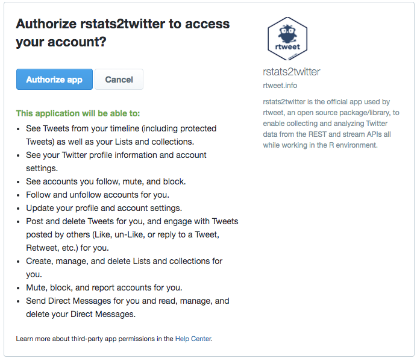

```{r, echo=FALSE, include=FALSE}
knitr::opts_chunk$set(comment = '', highlight = TRUE)
```

> All you need is a Twitter account (user name and password) and you can be up in running in minutes!

_Source: [`rtweet` README](https://cran.r-project.org/web/packages/rtweet/readme/README.html)_

# Introduction

Load packages:

```{r, message=FALSE}
# install.packages('rtweet')

library(rtweet)
library(tidyverse)
```

Documentation and resources:

- https://cran.r-project.org/web/packages/rtweet/readme/README.html
- https://cloud.r-project.org/web/packages/rtweet/rtweet.pdf
- https://cran.csiro.au/web/packages/rtweet/vignettes/intro.html


# `rtweet` package

<br>
**What is the `rtweet` package?**

- R package for interacting with Twitter's API (application programming interface)
- We can use it to make requests to Twitter's API and request data

<br>
**How to get started**:

- Create a [Twitter account](https://twitter.com/) if you don't have one already
- Load the `rtweet` package
- In your console (i.e., an interactive session of R), make a request to Twitter's API using one of `rtweet`'s functions (e.g., `search_tweets()`)
- A browser window should pop up, prompting you to log in your Twitter account and authorize the `rstats2twitter` app
<p></p>

  ```r
  > tweets <- search_tweets('#ucla')
  ```
  ```
  Requesting token on behalf of user...
  Waiting for authentication in browser...
  Press Esc/Ctrl + C to abort
  ```
  
<div align="center"></div>

# `search_tweets()` function

<br>
**The `search_tweets()` function**:

```{r, eval=FALSE}
?search_tweets

# SYNTAX AND DEFAULT VALUES
search_tweets(
  q,
  n = 100,
  type = "recent",
  include_rts = TRUE,
  geocode = NULL,
  max_id = NULL,
  parse = TRUE,
  token = NULL,
  retryonratelimit = FALSE,
  verbose = TRUE,
  ...
)
```

<br>
**Arguments**:

- `q`: query to be searched (same as if you searched [here](https://twitter.com/explore))
  - Use `OR` to search for tweets containing either search terms (e.g., `data OR science`)
  - Use `from:` to search for tweets from certain handles (e.g., `from:UCLA`)
  - Use `filter:` to only include certain kinds of tweets (e.g., `filter:verified`)
  - Use `-filter:` to exclude certain kinds of tweets (e.g., `-filter:replies`)
- `n`: total number of tweets to return
- `include_rts`: whether or not to include retweets in search results
- etc.

# Example

<br>
**Request data**:

We will use `rtweet` to pull Twitter data from the PAC-12 universities. We will use the university admissions Twitter handle if there is one, or the main Twitter handle for the university if there isn't one:

```{r}
# PAC-12 university handles
p12 <- c('uaadmissions', 'FutureSunDevils', 'caladmissions', 'UCLAAdmission',
         'futurebuffs', 'uoregon', 'BeaverVIP', 'USCAdmission',
         'engagestanford', 'UtahAdmissions', 'UW', 'WSUPullman')

# Use `OR` to search for tweets containing any of the handles
q <- paste0('from:', p12, collapse = ' OR ')
q
```

```{r, echo=FALSE}
# Load saved Twitter data
p12_df <- readRDS(url('https://github.com/anyone-can-cook/rclass2/raw/master/data/p12_dataset.RDS'))
```

```{r, eval=FALSE}
# Request Twitter data
p12_df <- search_tweets(q, n = 500)
```

<br>
**Analyze data**:

`search_tweets()` conveniently returns the data in a dataframe, so it's ready for you to perform data manipulations!

```{r}
# Inspect dataframe
str(p12_df, max.level = 1, strict.width = 'cut')

# Select certain variables
df <- p12_df %>% select('user_id', 'created_at', 'screen_name', 'text', 'location')
head(df)

# Filter and sort variables
df %>% filter(screen_name == 'UCLAAdmission') %>% arrange(created_at)

# Aggregate data
df %>% group_by(screen_name) %>% count() %>% arrange(desc(n))
```

