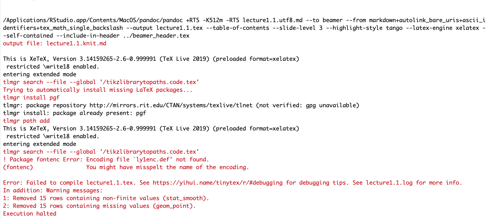
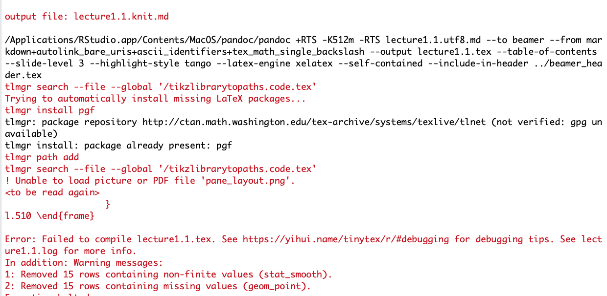

```{r setup, include=FALSE}
knitr::opts_chunk$set(echo = TRUE)
```

# 1. ly1enc error

- Error: __! Package fontenc Error: Encoding file `ly1enc.def' not found.__

```{r pressure, echo=FALSE, fig.cap="ly1enc error", out.width = '60%', fig.pos = 'h', fig.align = 'center'}

```

- Solution: run "tinytex::tlmgr_install('ly1')"


reference: [Link](https://stackoverflow.com/questions/56219404/rmarkdown-does-not-work-with-raleway-latex-package)


# 2. picture error

- Error: __! Unable to load picture or PDF file 'pane_layout.png'.__
 
```{r , echo=FALSE, fig.cap="picture error", out.width = '60%', fig.pos = 'h', fig.align = 'center'}

```

- Solution: download "Images" file from [Link](https://ozanj.github.io/rclass/lectures/lecture1/images.zip); unzip and save these files in the same folder you saved the lectures 
 

