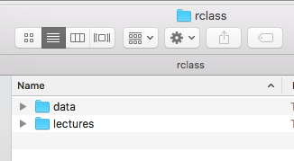
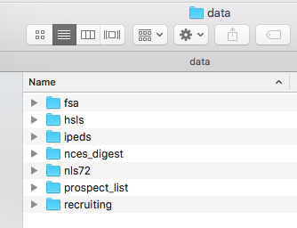
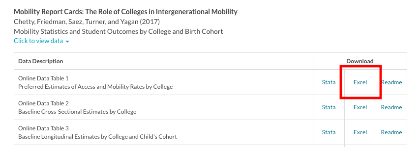
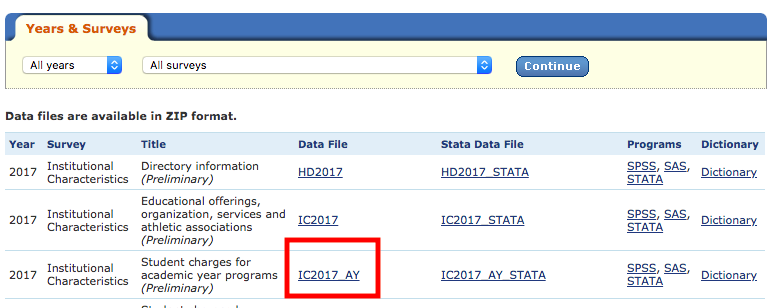

```{r echo=FALSE}
knitr::opts_chunk$set(collapse = TRUE, comment = "#>", highlight = TRUE)
#knitr::opts_chunk$set(collapse = TRUE, comment = "#>", highlight = TRUE)
  #comment = "#>" makes it so results from a code chunk start with "#>"; default is "##"
```

```{r, echo=FALSE, include=FALSE}
#THIS CODE DOWNLOADS THE MOST RECENT VERSION OF THE FILE beamder_header.tex AND SAVES IT TO THE DIRECTORY ONE LEVEL UP FROM THIS .RMD LECTURE FILE
download.file(url = 'https://raw.githubusercontent.com/ozanj/rclass/master/lectures/beamer_header.tex', 
              destfile = '../beamer_header.tex',
              mode = 'wb')
```

```{r, echo=FALSE, include=FALSE}
#DO NOT WORRY ABOUT THIS
if(!file.exists('tidyverse.png')){
  download.file(url = 'https://github.com/ozanj/rclass/raw/master/lectures/lecture10/tidyverse.png', 
                destfile = 'tidyverse.png',
                mode = 'wb')
}
```

```{r, echo=FALSE, include=FALSE}
#DO NOT WORRY ABOUT THIS
if(!file.exists('mrc_table1.png')){
  download.file(url = 'https://github.com/ozanj/rclass/raw/master/lectures/lecture10/mrc_table1.png', 
                destfile = 'mrc_table1.png',
                mode = 'wb')
}
```

```{r, echo=FALSE, include=FALSE}
#DO NOT WORRY ABOUT THIS
if(!file.exists('ic2017_ay.png')){
  download.file(url = 'https://github.com/ozanj/rclass/raw/master/lectures/lecture10/ic2017_ay.png', 
                destfile = 'ic2017_ay.png',
                mode = 'wb')
}
```

```{r, echo=FALSE, include=FALSE}
#DO NOT WORRY ABOUT THIS
if(!file.exists('rclass_folder.png')){
  download.file(url = 'https://github.com/ozanj/rclass/raw/master/lectures/lecture10/rclass_folder.png', 
                destfile = 'rclass_folder.png',
                mode = 'wb')
}
```

```{r, echo=FALSE, include=FALSE}
#DO NOT WORRY ABOUT THIS
if(!file.exists('rclass_folder_contents.png')){
  download.file(url = 'https://github.com/ozanj/rclass/raw/master/lectures/lecture10/rclass_folder_contents.png', 
                destfile = 'rclass_folder_contents.png',
                mode = 'wb')
}
```

# Intro/review

### What we will do today

\tableofcontents

```{r, eval=FALSE, echo=FALSE}
#Use this if you want TOC to show level 2 headings
\tableofcontents
#Use this if you don't want TOC to show level 2 headings
\tableofcontents[subsectionstyle=hide/hide/hide]
```


### Load the packages we will use today (output omitted) 

- __you must run this code chunk after installing these packages__
```{r warning=FALSE, message=FALSE}
library(dplyr)
library(readr)
library(haven)
library(readxl)
library(labelled)
```
__If package not yet installed__, then must install before you load. Install in "console" rather than .Rmd file

- Generic syntax: `install.packages("package_name")`
- Install "tidyverse": `install.packages("tidyverse")`

Note: when we load package, name of package is not in quotes; but when we install package, name of package is in quotes:

- `install.packages("tidyverse")`
- `library(tidyverse)`


## folders \& file paths  

### Rclass folder structure  


In lecture 1 we downloaded the rclass folder structure.  

- You should have an rclass folder like this with a lectures and a data subfolder.    

 

### Rclass folder structure  

- Inside the data subfolder, you should have the following subfolders:  
 


### Save data for lecture  

We will not be providing links to data in this lecture. Please save data to the corresponding folders.  

- First make sure to save __lecture10.Rmd__ in your lectures folder  
    - If you do not have class folder structure, you can download it [here](https://github.com/ozanj/rclass/raw/master/rclass.zip)
- Download and unzip data folder we are using for this lecture [here](https://github.com/ozanj/rclass/raw/master/lectures/lecture10/lecture10_data.zip) 
- Save data files in the corresponding data folder  
    - `ipeds_hd_2017_small.csv` should go in the __ic__ folder inside the ipeds folder  
    - `peps300.xlsx` should go in the __fsa__ folder  
    - `hsls_sch_small.dta` should go in the __hsls__ folder

### Working directory  

Your working directory will change depending on if you are using an R script or R markdown.

- **R script**  
    - The default working directory is your computer's home directory 
    - You only need to set your working directory `setwd()` in an r script once.  
- **R markdown**  
    - The default working directory is where the current r markdown file you are using is saved.  
    - If you set your working directory in a code chunk, it will be reset to the default directory after the code chunk is finished running.  
    - To avoid setting your working directory every time you read in data, you can read in data using a link to the data file or use the relative file path to save time.  
- **R project**  
    - The default working directory is in the R project location  
    - If you are working with an R script in an R project, the working directory is the R project main folder (ex. rclass)  
    - If you are working with an R markdown file in an R project, the working directory will be wherever the R markdown file is saved inside the R project.  
        - For example, you have an R markdown file saved inside the lectures folder in an R project "rclass", your working directory may look like this ("/Users/pm/Desktop/rclass/lectures")

```{r}
getwd()

```

### Absolute vs. relative filepath  

**Absolute file path**:  The absolute file path is the complete list of directories needed to locate a file or folder.  
`setwd("/Users/pm/Desktop/rclass/lectures/lecture10")`


**Relative file path**:  The relative file path is the path relative to your current location/directory. Assuming your current working directory is in the "lecture10" folder and you want to change your directory to the data folder, your relative file path would look something like this:  
`setwd("../../data")`  

  **File path shortcuts**  
            
| **Key** | **Description** |
| ------ | -------- |
| ~    | tilde is a shortcut for mac user's home directory   |
| ../    | moves up a level   |
| ../../    | moves up two level   |

```{r}

```


### Student exercises on relative file paths  

1. In the R-code chunk below, get your working directory `getwd()`   
```{r}

```
2. In the R-code chunk below, Using your relative file path, set your working directory to __fsa__ folder inside the __data__ folder using `setwd("filepath")`; then show working directory using `getwd()`; and then list the files in this directory using `list.files()`
```{r}

```
3. In the R-code chunk below, using your relative file path, set your working directory to the __ef__ folder inside the __ipeds__ folder inside the __data__ folder using `setwd("filepath")`; then show working directory using `getwd()`; and then list the files in this directory using `list.files()`
```{r}

```

### Student using relative file paths [SOLUTIONS]

BUT THE RIGHT SOLUTIONS MAY BE DIFFERENT FOR YOUR COMPUTER, DEPENDING ON HOW YOU ORGANIZED/NAMED FOLDERS

1. In the R-code chunk below, get your working directory `getwd()`   
```{r}
getwd()
```
2. In the R-code chunk below, Using your relative file path, set your working directory to __fsa__ folder inside the __data__ folder using `setwd("filepath")`; then show working directory using `getwd()`; and then list the files in this directory using `list.files()`

```{r}
setwd("../../data/fsa")
getwd()
list.files()
```
3. In the R-code chunk below, using your relative file path, set your working directory to the __ef__ folder inside the __ipeds__ folder inside the __data__ folder using `setwd("filepath")`; then show working directory using `getwd()`; and then list the files in this directory using `list.files()`
```{r}
setwd("../../data/ipeds/ef")
getwd()
list.files()
```

# readr package


### Common data formats associated packages/functions 


| **Format** | **Package** | **Function** |
| ------ | -------- | ------- | ------- |
| Comma-separated values (.csv) | readr | read_csv |
| Text-formated data (.txt) | readr | read_table |
| Tab-separated values (.tsv) | readr | read_tsv | 
| Stata (.dta) | haven | read_dta |
| SPSS (.sav) | haven | read_sav |
| SAS (.sas) | haven | read_sas |
| Excel (.xls or .xlsx) | readxl | read_excel |
| R (.Rdata or .rds) | base R | load() |  

- Source: Professor Darin Christensen

### readr package

The `readr` package contains functions to "read rectangular text data" into R
```{r, eval=FALSE}
?readr
```

- Part of [tidyverse](https://readr.tidyverse.org/index.html)
    - so `readr` package loaded every time you load `tidyverse`
    - Author: Hadley Wickham
- [LINK](https://cran.r-project.org/web/packages/readr/readr.pdf) to PDF with more detailed information on each function.
    - all `readr` functions to read-in data follow similar syntax/rules
    - which `readr` function to read-in which data format:

| **Format** | **Function** |
| ------ | -------- |
| Comma-separated values (csv)   | `read_csv`   |
| Semicolon separated files    | `read_csv2`   |
| Tab-separated values (tsv)    | `read_tsv`   |
| Any delimiter    | `read_delim`   |
| Fixed width files    | `read_fwf`   |
| Text-formated data (txt)    | `read_table` |
| Web log files    | `read_log` |


### readr syntax and arguments (for read_csv function)

\

```{r, eval=FALSE}
?read_csv
read_csv(file, col_names = TRUE, col_types = NULL, na = c("", "NA"), 
  comment = "", skip = 0, n_max = Inf,)
```

```{r, eval=FALSE, include=FALSE}
#For writing data
?write_csv
write_csv(x, path, na = "NA", append = FALSE, col_names = !append)
```

__Arguments__(selected)

- `file`: a filepath or URL to a file; or literal data
    - Files starting with `http://`, `https://` will be automatically downloaded
    - Literal data is most useful for examples and tests. 
- `col_types`. specifies data type for columns you read in
    - Can be one of the following: `NULL`, a `cols()` specification, or a string:  
    - `col_types = NULL` [default]: column data types guessed from the first 1000 rows
    - `col_types = cols()`: contents of `cols()` contain one specification for each column in `file`. 
    - `col_types = cols_only()`: If you only want to read a subset of the columns, . 
- `skip`. Number of lines to skip before reading data. 
- `col_names`. `TRUE`, `FALSE` or a character vector of column names.  
    - If `TRUE`, the first row of the input will be used as the column names.   
    - If `FALSE`, column names will be generated automatically: X1, X2, X3 etc.  
    - If `col_names` is a character vector, the values will be used as the names of the columns, and the first row of the input will be read into the first row of the output data frame.
- `na`. Character vector of strings to use for missing values
- `comment`. A string used to identify comments. 

## readr column specification

### read_csv, column specification

`readr` is pretty good at guessing each column's data type by looking at the first 1,000 rows (e.g. character, double, etc.)

```{r}
mtcars <- read_csv(readr_example("mtcars.csv"))
```

However it is good practice to manually specify the data type for each column using the `col_types` argument

### read_csv, column specification using `col_types` argument

The output of the previous example shows us the column specification readr gave us. 

If we do not like readr's guess, we could manually change column specification using `col_types = cols(...)` 
```{r}
mtcars <- read_csv(readr_example("mtcars.csv"), col_types = 
  cols(
    mpg = col_double(),
    cyl = col_integer(),
    disp = col_double(),
    hp = col_integer(),
    drat = col_double(),
    vs = col_integer(),
    wt = col_double(),
    qsec = col_double(),
    am = col_character(),
    gear = col_integer(),
    carb = col_character()
  )
)
```

### read_csv, column specification using `col_types` argument

Argument values for `col_types = cols` to choose desired data type

| **Data type** | **Arguments** |
| ------ | -------- |
| Logical (TRUE & FALSE)  | `col_logical()`   |
| Integers   | `col_integer()`   |
| Doubles    | `col_double()`   |
| Characters   | `col_character()`   |
| Numbers   | `col_numeric()` |
| Factors   | `col_factors(levels, ordered)` |
| Dates    | `col_date(format = "")`   |

```{r, results = "hide"}
read_csv(
  file = # here we specify literal data rather than filepath
    "a, b, c
     1,2,F
     4,5,T", 
  col_types = #specify data type for each column
    cols(
       a = col_factor(c("1", "2", "3", "4")),
       b = col_character(),
       c = col_logical() 
    )
)
```

### read_csv column specification, reading subset of columns

If you only want to read a subset of columns use `col_types = cols_only(...)` 
```{r}
mtcars_small <- read_csv(readr_example("mtcars.csv"), col_types = 
  cols_only(
    mpg = col_double(),
    cyl = col_integer(),
    disp = col_double(),
    hp = col_integer()
  )
)
```

__TIP__ 

- use `col_types = cols_only(...)`  approach when reading in data for real research project. 
- Approach:
    - read-in first column of data using `col_types = cols_only(...)`; make sure variable looks good
    - add second column of data to `cols_only()`
    - ....
    - add nth colulmn of data to `cols_only()`

## readr, other function arguments

### read_csv, reading in "literal data" rather than filepath

`readr` automatically treats the first line of data as column names. 
```{r}
read_csv(
  file = 
    "column_1, column_2, column_3
     1,-2,3
     4,5,6", 
  na = c(-2, "NA") # Here we specify that the values -2 and "NA" be set to missing
)
```


### read_csv, skip argument

When reading in a `file` you may want to tell R from what line to begin reading in data.

Below, first two lines of `file` are comments about the data. 

- use `skip = n` to skip `n` lines. 

```{r}
read_csv(
  file = 
    "This file contains data on student charges for the acdemic year.
     File name: IC2016_AY
     a, b, c
     1,2,3
     4,5,6", 
  skip = 2
)
```


### read_csv, comment argument

Tell R to drop lines we specify as comments using `comment` argument
```{r}
read_csv(
  file = 
    "# This file contains data on student charges for the acdemic year.
     a, b, c
     1,2,3
     4,5,6", 
  comment = "#"
)
```
### read_csv, comment argument

Tell R to drop lines we specify as comments using `comment` argument
```{r}
read_csv(
  file = 
    "* This file contains data on student charges for the acdemic year.
    a, b, c
    1,2,3
    4,5,6", 
  comment = "*"
)
```

### read_csv, column names argument

Tell R there are no column names with `col_names = FALSE` argument

```{r}
read_csv(
  file = 
    "1,2,3
    4,5,6", 
  col_names = FALSE
)
```
### read_csv, column names argument

Manually assign variable names using `col_names` argument

```{r}
read_csv(
  file = 
    "1,2,3
     4,5,6", 
  col_names =
    c("column_1", "column_2", "column_3")
)
```

### read_csv, column names argument

Manually assign variable names using `col_names` argument

- in this example, first line of `file` contains variable names, but we don't like these variable names
- we use `skip` argument to tell R that first line is not data
- use `col_names` argument to manually assign variable names
```{r}
read_csv(
  file = 
    "a,b,c
    1,2,3
    4,5,6", 
  skip = 1,  
  col_names = 
    c("column 1", "column 2", "column 3"), 
)
```


### read_csv, student exercise

1. Create a 3x3 tibble like the examples above  (e.g. read_csv("a,b,c....")), treating the first line as column names  
```{r}

```

1. Now on the first line add a sentence and use the `skip` argument to skip this line
```{r}

```

1. This time add a special character ( *, #, ! ) at the beginning of the sentence and indicate it is a comment  
```{r}

```

1. Delete the sentence and column names (should have a 2x2 tibble) and manually tell R column names
```{r}

```


### read_csv, student exercise solutions

1. Create a 3x3 tibble like the examples above  (e.g. read_csv("a,b,c....")), treating the first line as column names  
```{r}
read_csv("a, b, c
         1,2,3
         4,5,6"
         )
```

2. Now on the first line add a sentence and use the `skip` argument to skip this line  
```{r}
read_csv("Do not read this sentence
         a, b, c
         1,2,3
         4,5,6", skip = 1
         )

```

### read_csv, student exercise solutions continued 

3. This time add a special character ( *, #, ! ) at the beginning of the sentence and indicate it is a comment  
```{r}
read_csv("#This is a comment
         a, b, c
         1,2,3
         4,5,6",comment = "#"
         )
```
4. Delete the sentence and column names (should have a 2x3 tibble) and manually tell R column names
```{r}
read_csv("1,2,3
         4,5,6",col_names = c("a", "b", "c")
         )
```


## IPEDS data example

### read_csv demonstration using IPEDS data

Integrated Postsecondary Education Data System (IPEDS)

- Postsecondary education data from NCES  
- There are [12 survey components](https://nces.ed.gov/ipeds/resource/download/IPEDS_DataReleaseProcedures.pdf) and 3 collection periods  

We will be working with [Institutional Characteristics data of 2017](https://nces.ed.gov/ipeds/datacenter/DataFiles.aspx)  

### read_csv demonstration using IPEDS data

**Tying it all together**

Use `read_csv()` function from `readr` to import csv dataset into R without column specification. Follow along on your computers.
```{r, results="hide"}
ipeds <- read_csv(
  file="../../data/ipeds/ic/ipeds_hd_2017_small.csv"
)
# glimpse(ipeds)
```

### read_csv demonstration using IPEDS data

Use `read_csv()` function from `readr` to import csv dataset into R with column specification

```{r, results='hide'}

ipeds <- read_csv(
  file="../../data/ipeds/ic/ipeds_hd_2017_small.csv",
  col_types =
    cols(
      unitid = col_character(), 
      instnm = col_character(),
      stabbr = col_character(),
      sector = col_integer(),
      iclevel = col_integer(),
      control = col_integer()
    )
)
```
We changed unitid to character type, but could be left as is or changed to double type for example.  

### readr, trouble-shooting errors

1. Make sure you have downloaded and saved the flat file  
1. Make sure to know the file path of where data is downloaded or saved ("../../data")  
    - You can use the `list.files()` function to view what files you have in a particular folder
1. Make sure you set your working **`setwd()`** directory in R. To check your current working directory type **`getwd()`** in console. 

```{r echo=FALSE, eval=FALSE}
getwd()
list.files()
```

# Set variable and value labels  

### variable and value labels

Let's view variable and value labels from data frame `ipeds` we created
```{r}
ipeds %>% select(sector) %>% var_label()
ipeds %>% select(sector) %>% val_labels()
```

- There are no variable and value labels for this data. IPEDS has a separate do file with variable and value labels.  

- Let's practice manually adding variable and value labels using the `labelled` package.  

### Set variable labels and value labels

Before we setting variable labels and value labels, create a fictitious data frame
```{r}
df <- tribble(
  ~id, ~edu, ~sch,
  #--|--|----
  1, 2, 2,
  2, 1, 1,
  3, 3, 2,
  4, 4, 2,
  5, 1, 2
)
df
```


### Set variable labels
  
Use `set_variable_labels` function to manually set variable labels  

- `df %>% set_variable_labels(variable = "Variable label")`   
- `ipeds %>% set_variable_labels(unitid = "Unique ID number")`
    
```{r}
class(df$sch)

df <- df %>%
  set_variable_labels(
    id = "Unique identification number",
    edu = "Education level",
    sch = "Type of school attending"
  )

class(df$sch)
```

### Set value labels 

Use `set_value_labels` function to manually set value labels  

- `df %>% set_value_labels(varname = c("label A" = 1, "label B" = 2))`  

```{r}
class(df$sch)

df <- df %>%
  set_value_labels(
    edu = c("High School" = 1,
            "AA degree" = 2,
            "BA degree" = 3,
            "MA or higher" = 4),
    sch = c("Private" = 1,
            "Public" = 2)
  )

class(df$sch)
```

## IPEDS data example

### Goal: read in IPEDS data and [manually] add variable and value labels

- Open the data dictionary file for [hd2017](https://nces.ed.gov/ipeds/datacenter/data/HD2017_Dict.zip) data
- We are only working with these 6 variables (unitid, instnm, stabbr, sector, iclevel, control)  

```{r}
# Lets view values for sector
ipeds %>%
  count(sector) 
```

### Student exercise, add variable and value labels to IPEDS data

1. Using the codebook for hd2017 data, add variable labels for all 6 variables (unitid, instnm, stabbr, sector, iclevel, control) and save to new object `ipeds_labelled`

1. Add value labels for sector, iclevel, and control for `ipeds_labelled`

\
__hint__

- you can do use pipes to do both tasks in one line of code

```{r}

```


### Student exercise, add variable and value labels to IPEDS data [solution]

```{r}
# Need to manually assign variable and value labels using labelled package 
ipeds_labelled <- ipeds %>%
  set_variable_labels(unitid = "Unit identification number", 
                      instnm = "Institution name", 
                      stabbr = "State abbreviation",
                      sector = "Sector of institution",
                      iclevel = "Level of institution",
                      control = "Control of institution") %>%
  set_value_labels(sector = c("Administrative Unit" = 0, 
                              "Public, 4-year or above" = 1, 
                              "Private not-for-profit, 4-year or above" = 2,
                              "Private for-profit, 4-year or above" = 3, 
                              "Public, 2-year" = 4, 
                              "Private not-for-profit, 2-year" = 5, 
                              "Private for-profit, 2-year" = 6,
                              "Public, less-than 2-year" = 7, 
                              "Private not-for-profit, less-than 2-year" = 8,
                              "Private for-profit, less-than 2-year" = 9, 
                              "Sector unknown (not active)" = 99), 
                   iclevel = c("Four or more years" = 1, 
                               "At least 2 but less than 4 years" = 2, 
                               "Less than 2 years (below associate)" = 3,
                               "{Not available}" = -3),
                   control = c("Public" = 1, "Private not-for-profit" = 2, 
                               "Private for-profit" = 3, 
                               "{Not available}" = -3))

```

### Let's view new labelled data
```{r}
typeof(ipeds_labelled$iclevel)
class(ipeds_labelled$iclevel)
attributes(ipeds_labelled$iclevel)
```


# Reading in data from the web

### Reading in data from the web

- Save time  
    - Reduce the steps of downloading, saving, and reading in data  
    - Read in data directly from the internet  
    - **note** not all packages will work with downloading data from the web (read_excel)
 
For example, rather than downloading Raj Chetty data and saving it in a folder, we could download the data directly from the web.  

### Reading in data from web example using Raj Chetty data  

Equality of Opportunity Project  

- [Equality of Opportunity Project](http://www.equality-of-opportunity.org/papers/coll_mrc_paper.pdf) uses two data sources-- federal tax recoards and Department of Education records (1999-2013)-- to investigate intergenerational income mobility at colleges in the US.  

We will use [Mobility Report Cards: The Role of Colleges in Intergenerational Mobility data](http://www.equality-of-opportunity.org/documents/)


### Reading in data from web example using Raj Chetty data  

1. Follow this [link](http://www.equality-of-opportunity.org/data/) and under the "Mobility Report Cards..." tab select "click to view data".  
2. Choose "Online Data Table 1" 
3. Right click and copy link address for "Excel" (Note: it is actually a csv file)

\  

### Reading in data from the web  

Approach #1
```{r, message=FALSE}
#Paste url to excel "csv" file
data_url <- "http://www.equality-of-opportunity.org/data/college/mrc_table1.csv"

#Download data and read in using read_csv (readr)
mrc <- read_csv(data_url)

#View first 4 rows and 4 columns 
mrc[1:4, 1:4]
```


### Reading in data from the web 

Approach #2
```{r}
#Download data and read in link directly using read_csv (readr)
mrc <- read_csv("http://www.equality-of-opportunity.org/data/college/mrc_table1.csv")

```

### Reading in data from the web 
```{r}
#View first 4 rows and 4 columns 
mrc[1:4, 1:4]
```

### Problems downloading data (zip files) using IPEDS

1. Follow this [link](https://nces.ed.gov/ipeds/use-the-data) and under the "Survey Data" tab select "Complete data files".  
2. Choose "All years" and "All surveys" and click continue  
3. Right click and copy link address for "IC2017_AY" 

 

### Downloading data (zip files) using IPEDS

- Paste url and read in using `read_csv`  
    - `ipeds <- read_csv("link")`
What happens when you try reading in this file?  
```{r}

```
Need to download **and** unzip

## download.file function  

### download.file function  

`download.file` is a function use to download a file from the internet.  

__Usage (i.e., syntax)__: `download.file(url, destfile, method, quiet = FALSE, mode = "w")`

__Arguments__  

- `url`: A character string naming the URL of a resource to be downloaded  
- `destfile`: A character string with the name where the downloaded file is saved.  
- `method`: Method to be used for downloading files. Current download methods are "internal", "wininet" (Windows only) "libcurl", "wget" and "curl", and there is a value "auto"  
- `quiet`: If TRUE, suppress status messages (if any), and the progress bar.  
- `mode`: character. The mode with which to write the file. Useful values are "w", "wb" (binary), "a" (append) and "ab". Not used for methods "wget" and "curl"  
- `cacheOK`: logical. Is a server-side cached value acceptable?  
- `extra`: character vector of additional command-line arguments for the "wget" and "curl" methods.  
- `...`: allow additional arguments to be passed, unused

### download.file function

__Details__: The function download.file can be used to download a single file as described by url from the internet and store it in destfile. The url must start with a scheme such as http://, https://, ftp:// or file://.  

__Example__: Download data from the web
```{r, results="hide", eval=FALSE}
#Data from the Equality of Opportunity Project
download.file(url = "http://www.equality-of-opportunity.org/data/college/mrc_table1.csv",
              destfile = "table_1.csv") 
```

### unzip files
`unzip` is used to extract files from or list a zip archive.  

__Usage (i.e., syntax)__: `unzip(zipfile, files = NULL, list = FALSE, overwrite = TRUE, unzip = "internal", exdir = ".")`

__Arguments__  

- `zipfile`: The pathname of the zip file 
- `files`: A character vector of recorded filepaths to be extracted: the default is to extract all files.  
- `list`: If TRUE, list the files and extract none. 
- `overwrite`: If TRUE, overwrite existing files, otherwise ignore such files.  
- `junkpaths`: If TRUE, use only the basename of the stored filepath when extracting.   
- `exdir`: The directory to extract files to
- `unzip`: The method to be used.  


### Downloading data (zip files) using IPEDS
```{r}
#Set path to where data will be saved
#download file 
#getwd()
setwd("../../data/ipeds/ic")
download.file("https://nces.ed.gov/ipeds/datacenter/data/IC2018_AY.zip",
              destfile = "ic2018_ay", mode = "wb")
#unzip zip file 
unzip(zipfile = "ic2018_ay" , unzip = "unzip")

ic2018_ay <- read_csv("ic2018_ay.csv") %>%
  select(-starts_with("X"))

names(ic2018_ay) <- tolower(names(ic2018_ay)) #lowercase column names

#names(ic2018_ay)
```


### Student exercise

**Tying it all together** 

- Using everything we learned today, read in a csv data file from the web  
- Go back to the ipeds data center [here](https://nces.ed.gov/ipeds/datacenter/DataFiles.aspx)  
- Right click and copy the link address to a different data file ("HD2017", "EFFY2017")  
- Make sure to download the link first (download.file) before reading in the data  
- Change column names to lowercase `names(df) <- tolower(names(df))`
- Report dimensions of data `dim(df)`
- Create a subset of your data (filter, select, etc.)

```{r}

```


# readxl package

### readxl 
The `readxl`package is part of [tidyverse](https://readxl.tidyverse.org/), which is designed to read data from Excel and into R.  

- We could install tidyverse **install.package("tidyverse")** to access `readxl`, but have to explicitly load `readxl` because it is not a core tidyverse package  
    - `library(readxl)`  
- Or install `readxl`**install.packages("readxl")** and load it  
    - `library(readxl)`  
- For the purpose of this lecture, we just need to load **library(readxl)**.

### readxl

`readxl` supports both .xls and .xlsx formats and is designed to work with tabular data. It does not require dependencies-- making installing and operating fairly simple.  

`readxl` has several example files where we could use as practice. The files include: 
```{r}
readxl_example()
```

For now, lets use "datasets.xlsx"
```{r, warning=FALSE}
excel_example <- readxl_example("datasets.xlsx")
```


## readxl arguments

### readxl arguments  

Refer to the `readxl` package [pdf](https://cran.r-project.org/web/packages/readxl/readxl.pdf) for more detailed information on each function. 

__Arguments__  

- `sheet`: Sheet to read. Either a string (the name of a sheet), or an integer (the position of the sheet).  
- `n_max`: Maximum number of data rows to read  
- `range`: A cell range to read from  
- `cell_rows`: Cell rows to read from  
- `cell_cols`: Cell columns to read from  
- `na`: Character vector of strings to interpret as missing values


### readxl sheet  

Select the excel sheet you want to work with.
```{r, warning=FALSE}
#To view sheets in excel file
excel_sheets(excel_example)
```
```{r}
xl_example <- read_excel(excel_example, sheet = "quakes")
head(xl_example)
```

### readxl n_max  

Maximum number of rows to read
```{r}
read_excel(excel_example, sheet = "quakes", n_max = 3)
```

### readxl range  

A cell range to read from
```{r}
read_excel(excel_example, sheet = "quakes", range = "C1:E4")

read_excel(excel_example, sheet = "quakes", range = cell_rows(1:3))

head(read_excel(excel_example, sheet = "quakes", range = cell_cols("A:C")))
# using head() to only view first 6 rows 
```

### readxl na  

Character vector of strings to interpret as missing values
```{r}
read_excel(excel_example, sheet = "quakes", na = "-20.42")
```


### read_excel using FSA data

Federal Student Aid  

- Federal Student Aid Data Center provides information for federal assistance programs and is divided into four categories: 

      - Student Aid Data  
      - School Data  
      - Federal Family Education Loan (FFEL) Program  
      - Business Information Resources  
      
We will be working with [School Data](https://studentaid.ed.gov/sa/node/105)  


### read_excel student exercise using FSA data
Read in Federal Student Aid data using `readxl` function  
    - Excel file "peps300.xlsx" is saved in the fsa folder inside the data folder  
    
1. Use relative file path to read in data  
    - `read_excel("filepath/excelfile")`
```{r}

```
    
1. Read in first four rows (n_max)
```{r}

```

1. Read in columns from range Names to State **hint** `cell_cols`
```{r}

```

1. Set value "P" to missing (na) **note** : you need to investigate in detail before setting anything to missing
```{r}

```


### read_excel Student exercise solutions  
1. Use relative file path to read in data 
```{r}
#Read in data using readxl function
#getwd()
fsa <- read_excel("../../data/fsa/peps300.xlsx")
```
2. Read in first four rows (n_max)
```{r}
#Read in first four rows (n_max)
#setwd()
read_excel("../../data/fsa/peps300.xlsx", n_max = 4)
```

### read_excel Student exercise solutions continued
3. Read in columns from range Names to State **hint** `cell_cols`
```{r}
#Read in column Names to column State
#setwd()
head(read_excel("../../data/fsa/peps300.xlsx", range = cell_cols("B:E")))

```

### read_excel Student exercise solutions continued
4. Set value "P" to missing (na) **note** : you need to investigate in detail before setting anything to missing
```{r}
#setwd()
read_excel("../../data/fsa/peps300.xlsx", n_max = 4,  na = "P")
```

### readxl Running into problems
1. Make sure you have downloaded and saved excel file  
2. Make sure to know the file path of where data is downloaded or saved ("../../data")  
    - `list.files()`
3. Make sure you set your working **`setwd()`** directory in R. To check your current working directory type **`getwd()`** in console.  
4. Make sure to choose the correct sheet (if applicable)  
5. Pay attention to column names when setting range


# haven package

### haven

Recap from Augmented Vectors Lecture:   
    

haven is part of [tidyverse](https://haven.tidyverse.org/), which enables users to import and export data from the following statistical packages:  

- SAS
- SPSS
- Stata  
\

Similar to `readr`, we could load the entire **library(tidyverse)** package to get `haven`. 
For the purpose of this lecture, we will just need to load **library(haven)**.  

### haven functions  

Refer to the `haven` package [pdf](https://cran.r-project.org/web/packages/haven/haven.pdf) for more detailed information on each function. 

**haven's** (tidyverse) functions

| **Format** | **Function** |
| ------ | -------- |
| SPSS    | `read_sav`   |
| SAS    | `read_sas`   |
| Stata    | `read_dta`   |


### haven read and write Stata arguments

`read_dta(file, encoding = NULL)`  
`write_dta(data, path, version = 14)`  

__Arguments__  

- `file`: file path to data  
- `encoding`: the character encoding used for the file  
- `data`: data frame to save (write)  
- `path`: file path to where data will be saved  
- `version`: file version to use. Supports versions 8-15.  

[Link](https://haven.tidyverse.org/reference/read_dta.html)


### haven using HSLS data

High school longitudinal surveys from National Center for Education Statistics (NCES)

- Follow U.S. students from high school through college, labor market

We will be working with [High School Longitudinal Study of 2009 (HSLS:09)](https://nces.ed.gov/surveys/hsls09/index.asp)

- Follows 9th graders from 2009
- Data collection waves
      - Base Year (2009)
      - First Follow-up (2012)
      - 2013 Update (2013)
      - High School Transcripts (2013-2014)
      - Second Follow-up (2016) 
      
### haven Student exercise using HSLS data     

1. Use `read_dta()` function from `haven` to import Stata dataset into R  
```{r}

```

1. Use `write_dta()` function from `haven` to save Stata dataset  
```{r}

```

1. If you have time, explore data (View, glimpse, head, etc.)  
    - View variable and value labels  
    - Change class == labelled to class == factor
```{r}

```
    
    
### haven Student exercise solutions

Use `read_dta` function from `haven` to import Stata data
```{r, results="hide"}
hsls <- read_dta("../../data/hsls/hsls_sch_small.dta", encoding=NULL)

# View data
head(hsls)
glimpse(hsls)
```

Use `write_dta` function from `haven` to write Stata data

`write_dta(dataframe, path = ""`
```{r eval=FALSE}
write_dta(hsls, path = "../../data/hsls/hsls_sch_small.dta")
```

### haven Student exercise Solution continued...
Variable and Value labels
```{r}
# View variable labels
hsls %>% var_label()

```

### haven Student exercise Solution cont...
```{r}
#View value label for x1locale
hsls %>% select(x1locale) %>% val_labels()
```

### haven Student exercise Solution cont...
```{r}
# Change class == labelled to class == factor
hsls <- as_factor(hsls, only_labelled = TRUE)

typeof(hsls$x1region)
class(hsls$x1region)
attributes(hsls$x1region)
```


