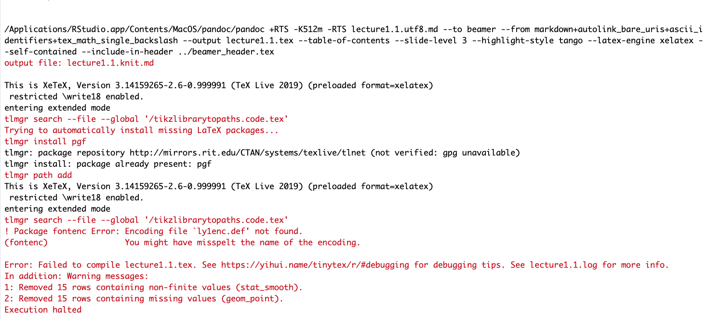
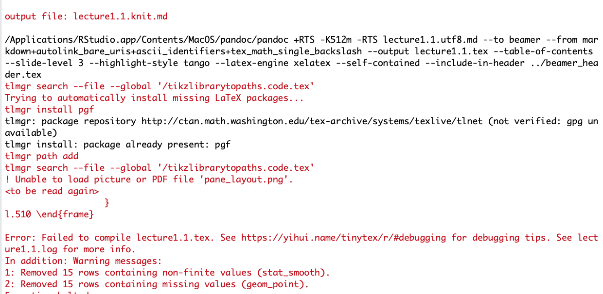

```{r setup, include=FALSE}
knitr::opts_chunk$set(echo = TRUE)
```

# 1. ly1enc error

- Error: __! Package fontenc Error: Encoding file `ly1enc.def' not found.__

```{r pressure, echo=FALSE, fig.cap="ly1enc error", out.width = '60%', fig.pos = 'h', fig.align = 'center'}

```

- Solution: run "tinytex::tlmgr_install('ly1')"


reference: [Link](https://stackoverflow.com/questions/56219404/rmarkdown-does-not-work-with-raleway-latex-package)


# 2. picture error

- Error: __! Unable to load picture or PDF file 'pane_layout.png'.__
 
```{r , echo=FALSE, fig.cap="picture error", out.width = '60%', fig.pos = 'h', fig.align = 'center'}

```

- Solution: download "Images" file from [Link](https://ozanj.github.io/rclass/lectures/lecture1/images.zip); unzip and save these files in the same folder you saved the lectures 
 
# 3. X11/XQuartz error [Mac users only]

- If you have a newer version of Mac or have recently upgraded to a newer version, you may need to reinstall [XQuartz](https://www.xquartz.org/). See the [R download page for Mac OS X](https://cran.r-project.org/bin/macosx/) for more information.

# 4. Files stored in Desktop/Documents that's backed using iCloud [Mac users only]

- If you are storing your files in the **Desktop** or **Documents** folder, you may run into issues when trying to refer to these paths because these folders are stored on iCloud by default. To resolve this issue, you may want to disable iCloud as described [here](https://support.apple.com/en-us/HT206985).
