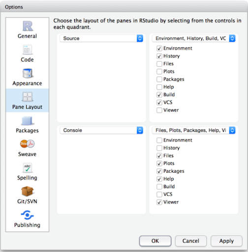

```{r, echo=FALSE}
knitr::opts_chunk$set(collapse = TRUE, comment = "#>", highlight = TRUE)
```
# Student introductions

### Student introductions

What we want to know about you:

\vspace{1mm}

1. Preferred name
1. Pronouns
1. Academic program (and how far along) and/or job
1. And answer one of these two questions:
    - What's something you would eventually like to learn how to do in R?
    - What's something that you have observed or think is important that people in your field aren't paying attention to?

# About your instructors

### Xin Li, teaching assistant


Programming

- Started with Stata, Eviews, SPSS
    - survey data
  
  
- Moving to R, Python
    - data management
    - web-scraping, parsing
  
Research 

- Heterogeneous returns to education
    - migration, professional programs, school-student mismatch 

- Education policy evaluation
    - university application reform (parallel mechanism, submission timing)
  
### Ozan Jaquette, instructor

My background in data management/statistical analysis

- Started with SAS [ugh]
    - After college, reseearch analyst using administrative data on welfare records (I was awful for 12 months!)
    - student-level data on English "further education colleges"
    - created single analysis dataset from high school longitudinal surveys from seniors in 1972, 1982, 1992, 2004
- Moved to Stata
    - Used loops and user-defined functions to create longitudinal datasets of university characteristics/behaviors from 1969 to present


I thought I was pretty hot stuff!

- But the game changed on me

### Recruiting research program and "data science"

Got sick of the limitations of survey data

- didn't ask questions I was interested in
- I didn't believe the survey responses

Wanted to figure out ways to collect data on university recruiting behavior

- Karina Salazar and I realized "data science" methods could create concrete data about recruiting behavior from publicly available data sources

The off-campus recruiting project

- Used programming language Python to scrape data about off-campus recruiting visits by universities from university admissions websites
    - We could have done all the web-scraping in R
- Used R for most analyses (e.g., descriptive statistics, regression models, interactive maps)
- [Link to project website](https://emraresearch.org/)
- [Link to 2018 New York Times op-ed](https://www.nytimes.com/interactive/2018/04/13/opinion/college-recruitment-rich-white.html)

# Why R?

### What is R

According to the Inter-university consortium for political and social research [(ICPSR)](https://www.icpsr.umich.edu/icpsrweb/content/shared/ICPSR/faqs/what-is-r.html):

> R is "an alternative to traditional statistical packages such as SPSS, SAS, and Stata such that it is an extensible, open-source language and computing environment for Windows, Macintosh, UNIX, and Linux platforms. Such software allows for the user to freely distribute, study, change, and improve the software under the [Free Software Foundation's GNU General Public License](https://www.gnu.org/home.en.html)."

- For more info visit [R-project.org](https://www.r-project.org/about.html)

### Base R vs. R packages

There are "default" packages that come with [R](https://stat.ethz.ch/R-manual/R-devel/library/base/html/00Index.html). Some of these include:  

- `as.character`  
- `print`  
- `setwd`

And there are [R packages](http://r-pkgs.had.co.nz/intro.html) developed and shared by others. Some R packages include:  

- `tidyverse`  
- `stargazer`  
- `foreign`  

more about these in later weeks...

### Installing and Loading R packages
You only need to install a package once. To install an R package use `install.package()` function.
```{r warning=FALSE, message=FALSE}
#install.packages("tidyverse")
```

However, you need to load a package everytime you plan to use it. To load a package use the `library()` function. 
```{r}
library(tidyverse)
```
### RStudio

"[RStudio](https://www.rstudio.com/products/rstudio/features/) is an integrated development environment (IDE) for R. It includes a console, syntax-highlighting editor that supports direct code execution, as well as tools for plotting, history, debugging and workspace management."



### R Markdown
[R Markdown](https://rmarkdown.rstudio.com/) produces dynamic output formats in html, pdf, MS Word, dashboards, Beamer presentations, etc.

- We will be using R Markdown for lectures and homeworks.

### Why learn R? R can do a lot of stuff!

How we have used R+RStudio+RMarkdown in our research team

- Stuff traditional statistical software (e.g., SPSS, Stata) can do
    - Data manipulation, creating analysis datasets
    - [Descriptive statistics and statistical models](https://ozanj.github.io/soc_of_ed_presentation/#/slide-15)
    - Graphs
    
- Stuff traditional statistical software cannot do
    - [Static policy reports](https://emraresearch.org/sites/default/files/2019-03/joyce_report.pdf)
    - Static presentations
        - All lectures for this class written in RMarkdown
    - [Interactive presentations](https://ozanj.github.io/joyce_report/#/title)
    - [Interactive maps](https://ozanj.github.io/joyce_report/#/4)
    - [Interactive dashboards](https://jkcf.shinyapps.io/dashboard/)
    - Interactive graphs

Some of the other stuff R can create/do:

- [Websites](https://bookdown.org/yihui/rmarkdown/websites.html); [journals](https://bookdown.org/yihui/rmarkdown/journals.html); [books](https://bookdown.org/); [web- scraping](https://www.analyticsvidhya.com/blog/2017/03/beginners-guide-on-web-scraping-in-r-using-rvest-with-hands-on-knowledge/); network analysis; machine learning/artificial intelligence

### Graphs 
- Create graphs with [ggplot2](https://ggplot2.tidyverse.org/) package 

```{r echo=FALSE, warning=FALSE}
# Source: http://r-statistics.co/Top50-Ggplot2-Visualizations-MasterList-R-Code.html
# install.packages("ggplot2")
# load package and data
options(scipen=999)  # turn-off scientific notation like 1e+48
library(ggplot2)
theme_set(theme_bw())  # pre-set the bw theme.
data("midwest", package = "ggplot2")
# midwest <- read.csv("http://goo.gl/G1K41K")  # bkup data source

# Scatterplot
gg <- ggplot(midwest, aes(x=area, y=poptotal)) + 
  geom_point(aes(col=state, size=popdensity)) + 
  geom_smooth(method="loess", se=F) + 
  xlim(c(0, 0.1)) + 
  ylim(c(0, 500000)) + 
  labs(subtitle="Area Vs Population", 
       y="Population", 
       x="Area", 
       title="Scatterplot", 
       caption = "Source: midwest")

plot(gg)
```

# What is this course about?

### What is data management?

- All the stuff you have to do to create analysis datasets that are ready to analyze, e.g.:
    - collect data
    - read/import data into statistical programming language
    - clean data
    - integrate data from multiple sources (e.g, join/merge, append)
    - change organizational structure of data so it is suitable for analysis
    - create "analysis variables" from "input variables"
    - Make sure that you have created analysis variables correctly

### Why I don't call this class "R for data science"

Learn to walk before you can run!

- "data science" implies doing fancy, sexy things like mapping, network analysis, web-scraping, etc.
- But if you don't know how to clean data, these sexy analyses and visualizations will be useless
- "80% of data science is data cleaning"
- The skills you learn in this data management oriented class will be usefull for fancy data science stuff down the road!

### Who is this class for?

This class is for anyone who wants to work with data, that is people who want to be:

- researchers working with survey data and doing traditional statistical analyses
- researchers who want to do "data science" oreinted research 
- analysts working at think tanks/non-profits or as institutional researchers
- journalists who create interactive data visualizations


# Syllabus/logistics

### Syllabus and course logistics

FOLLOW ALONG ON SYLLABUS

Course links:

- Link to syllabus: https://github.com/ozanj/rclass/raw/master/syllabus/syllabus.pdf 
- Link to resources page of course website: https://ozanj.github.io/rclass/resources/ 
- Link to Piazza website, which we will use for online discussion/questions: https://piazza.com/ucla/fall2019/educ263/home 

# Directories and filepaths 

### Directories and filepaths

- Give you a very brief overview of "directories" (i.e., folders) and "filepaths" (tells you where folder is located) in R
- Why? After this overview we will ask you to create the directory structure you will use for all files related to this class
- Your problem set due before class next Friday will give you more practice with filepaths and we have created a short document that may be helpful in working through this problem set [LINK](https://github.com/ozanj/rclass/raw/master/lectures/problemset_resources.pdf) 

### Working directory

__(Current) Working directory__

- the folder/directory in which you are currently working
- this is where R looks for files
- Files located in your current working directory can be accessed without specifying a filepath because R automatically looks in this folder

Function `getwd()` shows current working directory
```{r}
getwd()
```
Command `list.files()` lists all files located in working directory
```{r, results="hide"}
list.files()
```

### Working directory, "Code chunks" vs. "console" and "R scripts"

When you run __code chunks__ in RMarkdown files (.Rmd), the working directory is set to the filepath where the .Rmd file is stored

```{r}
getwd()

```

```{r, results="hide"}
list.files()
```

When you run code from the __R Console__ or an __R Script__, the working directory is:

- if you are working on an R "Project", the working director is the main directory for the project


```{r, results="hide"}
getwd()
```

### Absolute vs. relative filepath  
**Absolute file path**:  The absolute file path is the complete list of directories needed to locate a file or folder.  
`setwd("/Users/pm/Desktop/rclass/lectures/lecture2")`


**Relative file path**:  The relative file path is the path relative to your current location/directory. Assuming your current working directory is in the "lecture2" folder and you want to change your directory to the data folder, your relative file path would look something like this:  
`setwd("../../data")`  

            File path shortcuts

| **Key** | **Description** |
| ------ | -------- |
| ~    | tilde is a shortcut for user's home directory (mine is my name pm)   |
| ../    | moves up a level   |
| ../../    | moves up two level   |


# Create "R project" and directory structure

### What is an R project? Why are you doing this?

What is an "R project"?

- helps you keep all files for a project in one place
- When you open an R project, the file-path of your current working directory is automatically set to the file-path of your R-project

Why are we asking you to create R project and download a specific directory structure?

- We want you to be able to run the .Rmd files for each lecture on your own computer
- Sometimes these .Rmd files point to certain sub-folders
- If you create R project and create directory structure we recommend, you will be able to run .Rmd files from your own computer without making any changes to file-paths!

### Follow these steps to create "R project" and directory structure

1. Download this zip folder: [LINK HERE](https://github.com/ozanj/rclass/raw/master/rclass.zip)
    - this zip file contains the shell file directory you should use for this class
    - Unzip the folder
        - contains folder named "rclass"; this is the folder that will contain all materials for this course
        - "rclass" contains two folders: "data" and "lectures"
    - Move "rclass" folder to your preferred location (e.g, documents, desktop, dropbox, etc)
2. In RStudio, click on "File" >> "New Project" >> "Existing Directory" >> "New Project"
    - "Browse" to find "rclass" folder you just saved
    - Then click on Create Project
3. Save the following files in "rclass/lectures/lecture1"
    - lecture1.1.Rmd
    - lecture1.1.pdf
    - lecture1.2.Rmd
    - lecture1.2.Pdf
    - lecture1.2.R

### Next,you follow these steps

- you can add any additional sub-folders you want to the "rclass" folder
    - e.g., "syllabus", "resources"
- You can add any additional files you want to the sub-directory folders you unzipped
    - e.g., in "rclass/lectures/lecture1" you might add an additional document of notes you took


