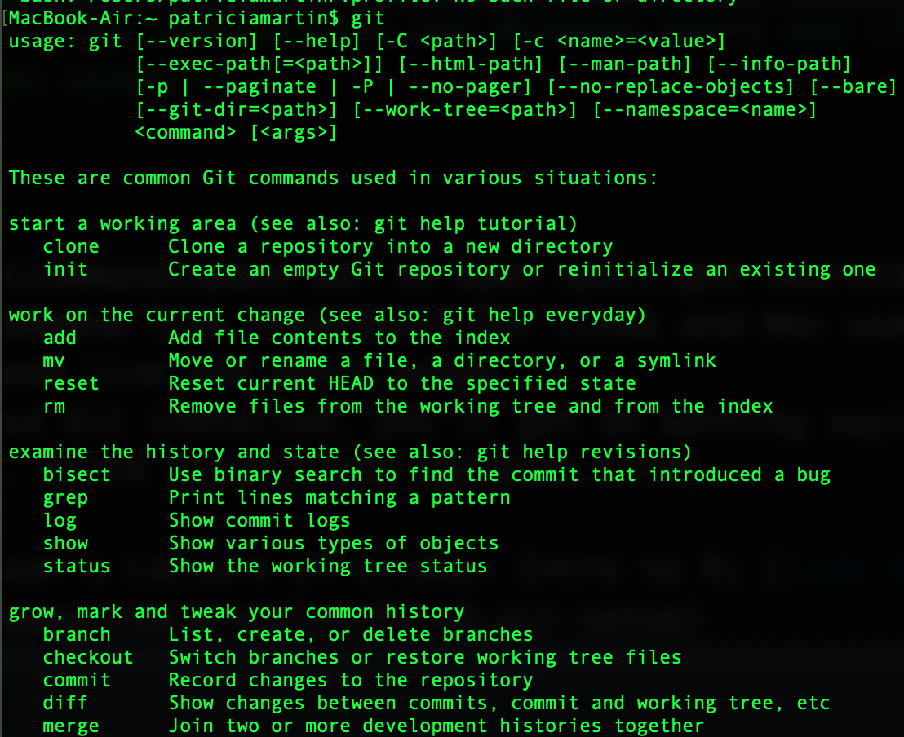
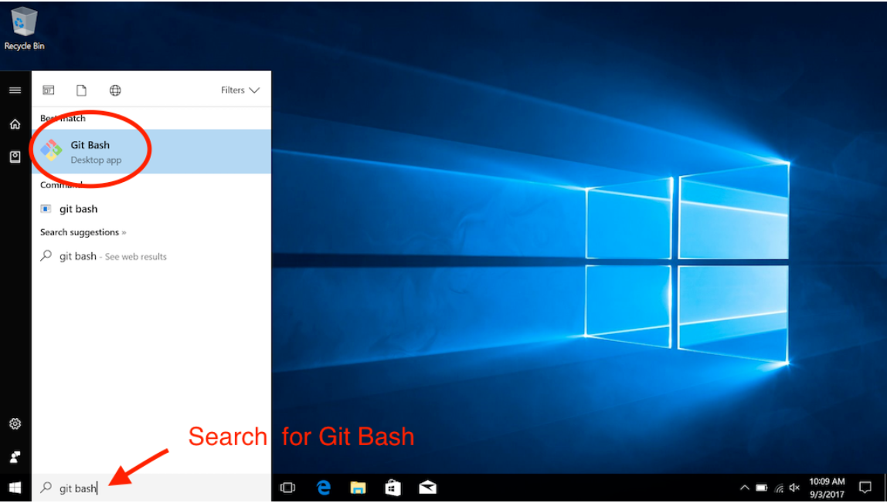
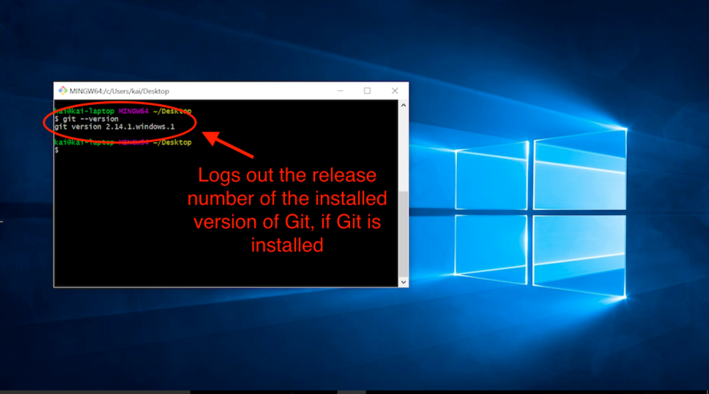

```{r setup, include=FALSE}
knitr::opts_chunk$set(echo = TRUE)
```
***
#### The instructions below will assist you in installing Git on your local computers. 
**Note: If you are a Mac user skip instructions for Windows Users and if you are a Windows User skip instructions for Mac users.**  

## Create GitHub account  
  1. Go to https://github.com/ and sign up for GitHub  
  2. Once you have successfully created a GitHub account, you will receive an email to verify your account. Follow the instructions on the email.  
  3. Email your username to me at pmarti@g.ucla.edu


## Git Setup for Mac Users  
  1. Open a Terminal window (command+space bar to open Spotlight Search)  
    + Terminal is the CLI (command line interface) for Linux and Mac users
  2. Type in `git` to the command line and press enter 
  3. If you don’t already have Git installed, you’ll get an warning saying Git requires
command line developer tools. Click install and agree to terms.  
    + After typing git in your terminal you should see something like this  
      { width=60%  }  
  4. You can check what version you have installed by typing `git --version` in the command line

 
## Git Setup for Windows Users  
  1. Need to first install Git Bash
    + Bash is the default shell (a specific type of CLI) so only Windows users need to install this first. Windows default is Command Prompt.
    + Download and intall Git Bash: https://gitforwindows.org/
    + Run the downloaded .exe file and allow the application to make changes to your
PC.
    + Once it is finished install, check it installed by searching “git bash” in your start
menu
    { width=75%  }  
    
  2. Open your CLI and verify Git installed
    + Click on the Git Bash icon to open a new CLI window
    + Type in git --version and press enter
    + If installed it will return which Git version is installed  
    { width=75%  }  
 
  
## Code academy tutorial [optional] (10-20 min read) 
  1. Read through this tutorial on getting started with GitHub https://www.codecademy.com/articles/f1-u3-git-setup  
  
## Hello World GitHub Guide [optional] (10-20 min read) 
  1. Read through this short tutorial on GitHub https://guides.github.com/activities/hello-world/  
  
***
**Sources:** Dr. Karina Salazar's Lecture 14 slides: Intro to R; [Code Acaademy Tutorial](https://www.codecademy.com/articles/f1-u3-git-setup)  
